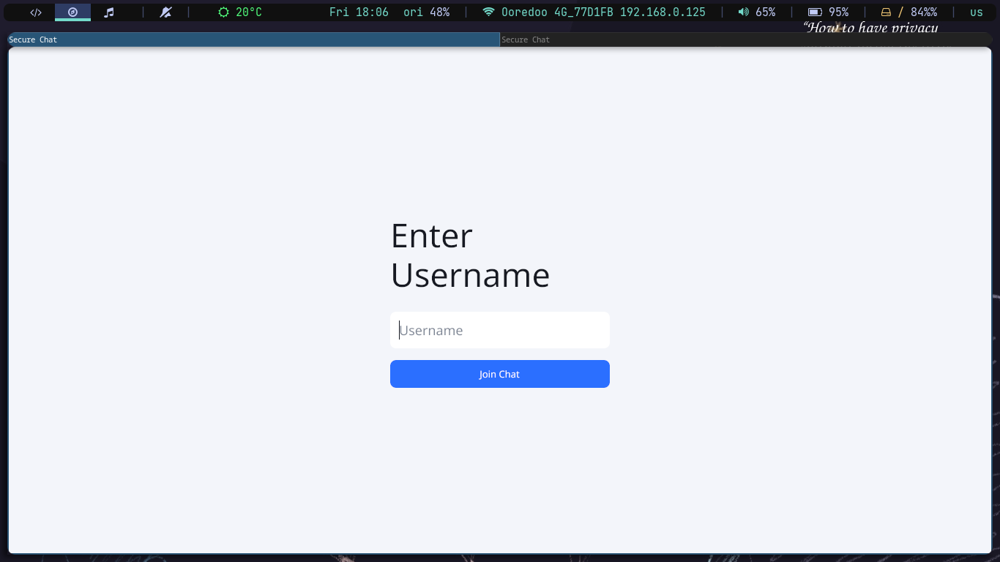
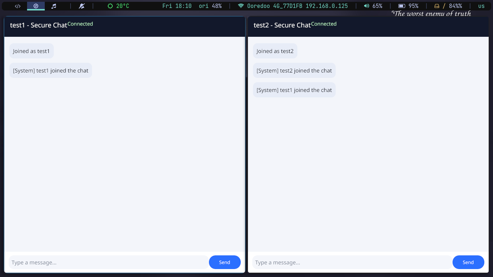
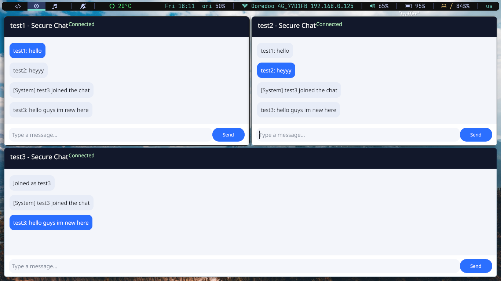

# 2026-04-03

# Technology
- Language: Go (module `chat_sec`, see `go.mod`)
- UI: Gio (gioui.org) for the desktop client
- Networking: TCP sockets
- Crypto: Custom RSA implementation in `server/enc` (keygen, encrypt/decrypt, base64 marshaling)

# Project Structure
- `main.go`: Gio desktop chat client (GUI)
- `server/main.go`: TCP chat server (broadcast + RSA decrypt)
- `server/enc/ma_rsa.go`: RSA implementation used by server and clients
- `assets/`: UI screenshots
- `main`, `client/client`, `server/server`, `chat_sec`: built binaries
- `go.mod`, `go.sum`: Go module metadata

# How Does the Server Works
- On startup, the server generates a 2048-bit RSA key pair and starts listening on TCP port `9001`.
- When a client connects, the server sends `PUBKEY:<base64(N)|base64(E)>` as the first line.
- Client sends `USERNAME:<name>`; server stores the connection and broadcasts a system join message.
- Each client message is sent as `MSG:<base64(ciphertext)>`.
- Server base64-decodes the ciphertext, decrypts with the RSA private key, and broadcasts the plaintext to all clients as `<username>: <message>`.
- Disconnects remove clients and broadcast a system leave message.

## Client See
- GUI client (`main.go`) opens a window with a username entry screen, then a chat view.
- Chat view shows a header (username + status), a scrollable message list, and an input bar with a Send button.
- Outgoing messages are encrypted with the server public key and sent as `MSG:` payloads.
- CLI client (`client/main.go`) prompts for username, prints incoming messages, and sends encrypted text on each line.

```bash
go run server/main.go
```

In another terminal:

```bash
go run main.go     # GUI client
```

Notes:
- Default host/port: `localhost:9001` in both clients and server.
- Message size is limited by RSA key size (2048-bit key → max plaintext ~245 bytes in this implementation).
- The RSA implementation is raw (no padding/auth). It is fine for a demo but not secure for production.

# The View
Screenshots from `assets/`:




