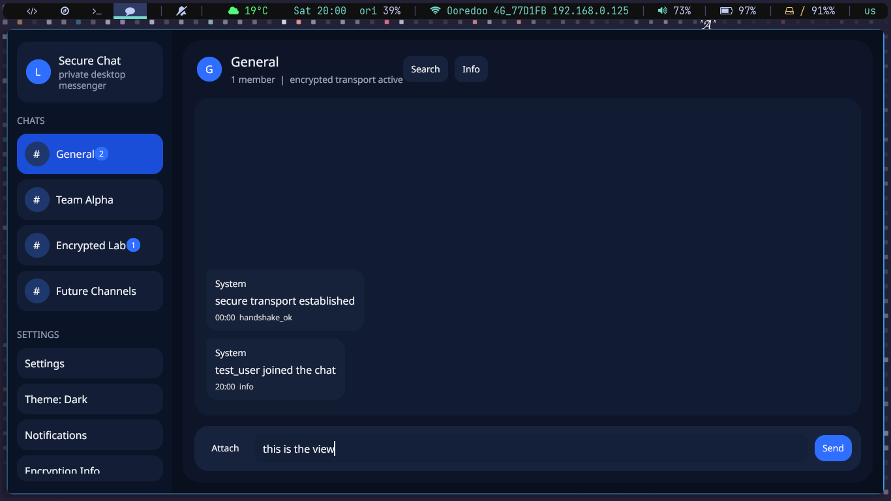
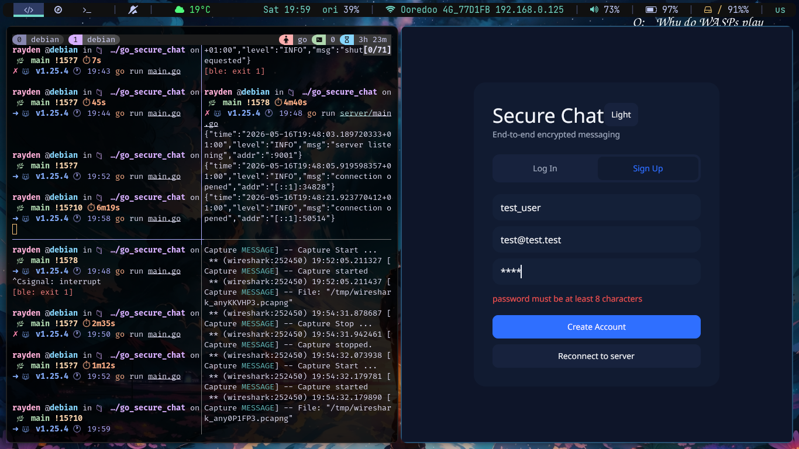
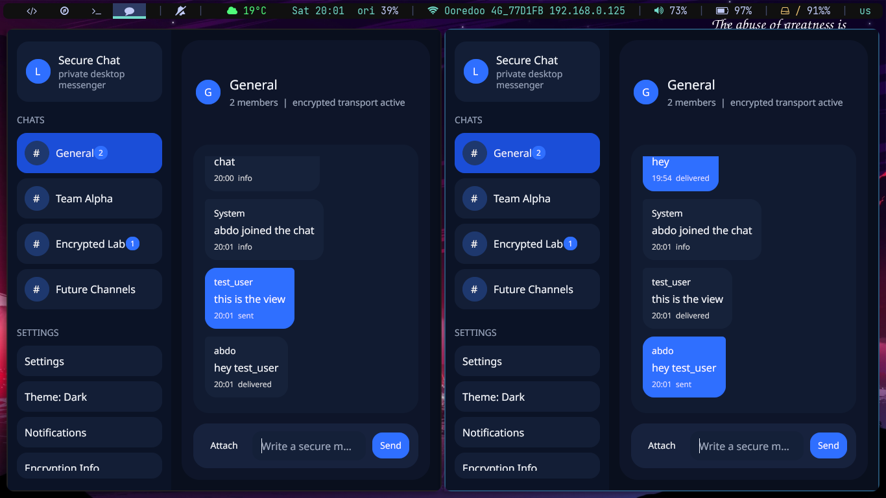
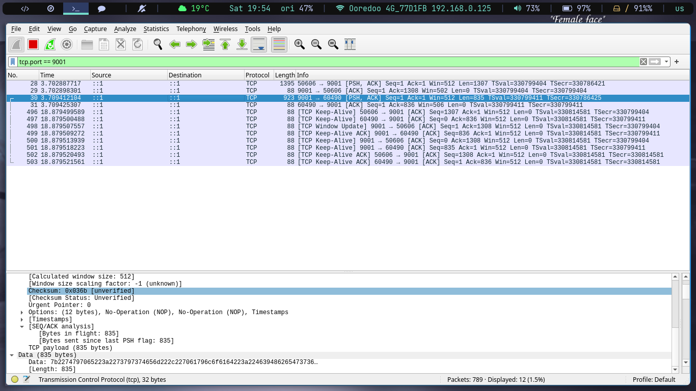
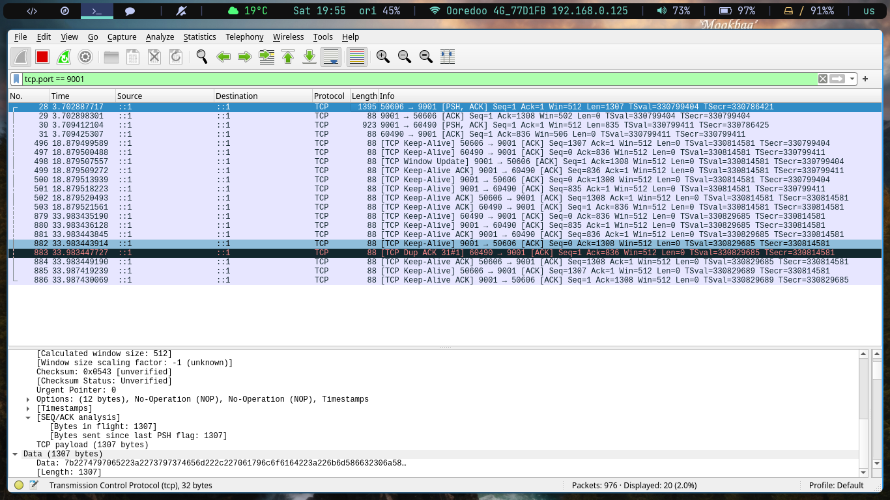
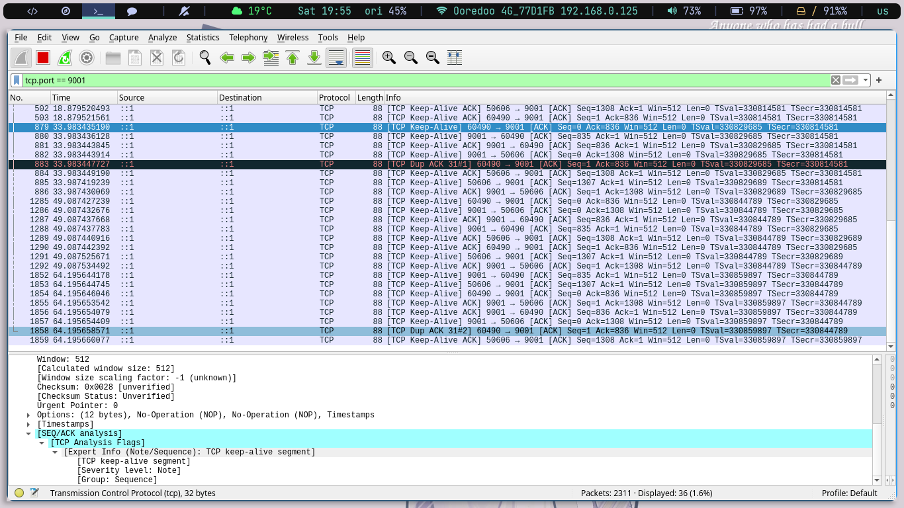

# Server Report

## Overview

The server lives in `cmd/server/main.go` — that's where everything kicks off. There's an older `server/` directory kicking around from a previous iteration, but it's dead code at this point. The module wiring all points to the newer stuff now.

## Stack

Go on the backend, talking over plain TCP sockets. Nothing fancy there. Packets are JSON, newline-delimited, so we can just use a buffered reader and `json.Encoder` without overthinking framing.

For storage we're using SQLite through `go-sqlite3`. Passwords get bcrypt hashed (via `x/crypto`). Logging goes through `slog` because structured logs make debugging less awful.

Crypto-wise: RSA-OAEP with SHA-256 for the handshake and key wrapping, AES-GCM for the actual transport encryption and message payload encryption. The client UI is built with Gio but that's a separate concern — the server doesn't care about that.

## Package Breakdown

### `cmd/server`

Dead simple entrypoint. Grabs the `-addr` flag, calls `network.RunServer`, done. All the actual logic lives deeper in.

### `internal/network`

This is where things get interesting. The `Server` struct owns the listener, the client map, the database handle, and the server's RSA keypair. The `Client` struct represents a single connection — it holds the socket, the negotiated AES key, the user's identity public key, and a buffered send channel.

What it actually does:
- Accepts TCP connections in a loop
- Runs the handshake protocol for each new connection
- Tracks who's online
- Checks credentials against the database
- Broadcasts peer list updates when people join or leave
- Persists encrypted messages to the database
- Routes messages to the right recipients

Worth mentioning: it generates a fresh RSA keypair every time the server starts. That's intentional — there's no persistent server identity in the current design. Each connection gets its own goroutine for reading and another for writing, so slow clients don't clog things up. Shutdown is graceful — it catches SIGINT and SIGTERM, closes the listener, drains what it can, and waits for goroutines to finish.

### `internal/protocol`

Defines the `Packet` struct that both sides agree on. Packet types are: `handshake`, `auth_signup`, `auth_login`, `message`, `system`, `error`, and `peer_sync`.

The validation rules aren't particularly strict — mostly just checking that required fields are present for each packet type. Handshake needs a payload, auth needs email and password, messages need a message ID, ciphertext, and at least one recipient key.

Also handles the JSON serialization and the line-based reading from the TCP connection. We use newlines as delimiters because it's simple and works fine with buffered I/O.

### `internal/crypto`

Two files: `aes.go` and `rsa.go`. Fairly self-contained.

AES side: key generation, encrypt/decrypt with GCM mode (so we get authentication built in).

RSA side: keypair generation (2048-bit), public key marshaling/unmarshaling (we send those over the wire as JSON), OAEP encryption/decryption with SHA-256, and PEM encoding for private keys when we need to store them.

Nothing custom or clever here — just straightforward wrappers around the standard library's crypto packages with the parameters we want.

### `internal/storage`

SQLite layer. Handles:

- Opening the database file
- Running migration SQL from the `migrations/` directory
- A compatibility shim for an older schema that used `mail` instead of `email` and `password` instead of `password_hash`
- Input validation for signup fields (basic stuff — non-empty, reasonable lengths, that kind of thing)
- User creation with bcrypt password hashing
- Login verification (hash comparison)
- Saving encrypted messages — one row per recipient, so each row stores the ciphertext and that specific recipient's wrapped key
- Loading history for a user when they log in (capped at 200 records)

The schema migration thing is worth noting because it means the codebase evolved from something earlier and we kept backward compatibility rather than forcing a destructive migration. The column rename is handled in Go code rather than pure SQL.

## Architecture

Layers, bottom to top:

1. `internal/crypto` — primitives (AES, RSA)
2. `internal/storage` — persistence (users, messages)
3. `internal/protocol` — wire format (packets, validation)
4. `internal/network` — orchestration (sockets, sessions, routing)
5. `cmd/server` — startup

The server's role is basically a message router that doesn't get to see what it's routing. It terminates the transport encryption so it can read enough metadata to do its job (packet types, usernames, routing info), but the actual message payloads are encrypted with keys the server never has.

## Startup Sequence

`RunServer` does the following in order:

1. Sets up a JSON logger so we get structured output
2. Opens `db.db` via the storage layer
3. Runs `migrations/001_users.sql` to make sure the schema is current
4. Generates a 2048-bit RSA keypair (ephemeral — not saved to disk)
5. Binds to the configured address and starts listening
6. Registers signal handlers for SIGINT/SIGTERM
7. Loops on `Accept()`, spawning a goroutine per connection

## Connection Lifecycle

When a new TCP connection comes in, `handleConn` takes over:

1. Server immediately sends its public RSA key in the clear. This is the one unencrypted packet in the whole protocol.
2. Client generates a random AES key, encrypts it with the server's RSA public key (OAEP-SHA256), base64-encodes the result, and sends it back in a `handshake` packet.
3. Server decrypts with its private key. Now both sides share an AES key.
4. Server creates a `Client` object holding the socket, the AES key, a buffered send channel, and whatever state is still unknown (username, identity key, etc.).
5. Spawns a writer goroutine that reads from the send channel, encrypts each packet with AES-GCM, and writes to the socket.
6. Sends a `handshake_ok` system packet through the now-encrypted channel.
7. Drops into the read loop — everything from here on is encrypted.

## Protocol

### Wire Format

Every packet is a JSON object followed by a newline. We use `json.Encoder` on the write side and a buffered line reader on the receive side.

The `Packet` struct has fields for all the things that might appear in any packet type: type, username, email, password, payload, timestamp, public_key, message_id, ciphertext, encrypted_keys, status, error, peers. Not all fields are used by every packet type — the validation layer enforces which ones must be present.

### The Two-Layer Thing

After the handshake, there are two layers:

**Outer envelope** — this is what actually goes over TCP. It's always a system packet with `status: "transport"` and the payload is a base64-encoded AES-GCM ciphertext. This layer exists so we have a uniform way to encrypt everything.

**Inner packet** — the actual application data. Could be an auth attempt, a chat message, a peer sync, whatever. The inner packet gets marshaled to JSON, encrypted with the session AES key, and stuffed into the outer envelope's payload field.

Both client and server do this same wrapping/unwrapping dance for every message after the handshake completes.

### Validation

Not super rigorous, but catches the obvious stuff:

- Handshake packets must have a payload field
- Auth packets (signup and login) must have email and password
- Message packets need message_id, ciphertext, and at least one entry in encrypted_keys
- Unknown packet types get rejected outright

## Authentication

### Signup

Client sends `auth_signup` with email, password, username, and their public RSA identity key. Server validates that the public key is present (no anonymous users), creates the user in SQLite with a bcrypt hash of the password, and immediately authenticates with those credentials.

### Login

Client sends `auth_login` with email, password, and public key. Server looks up the email, compares the bcrypt hash, and if it matches, binds the session to that username.

### Post-Auth

`finishAuth()` links the connection to the authenticated identity. The server checks that the same username isn't already connected (no duplicate sessions). Then it sends:

- `auth_ok` — confirms the login worked
- Message history — up to 200 stored messages for that user, each marked with `status: "history"`
- Current peer list — everyone who's online right now with their public keys

After that, it broadcasts to all connected clients:
- An updated peer list (so everyone knows the new person is here)
- A system message announcing the join

### Password Storage

Plaintext passwords never touch the database. The storage layer runs `bcrypt.GenerateFromPassword` on signup and `bcrypt.CompareHashAndPassword` on login. Standard stuff.

## Peer Tracking

Active sessions are stored in a `map[string]*Client` where the key is the username. Each `Client` entry holds:

- Username and email
- The session's AES transport key
- The user's RSA public identity key (this is what other clients use to encrypt messages for them)
- A buffered send channel for outgoing packets
- The remote address (mostly for logging)

When the set of online users changes, the server builds a `peer_sync` packet containing an entry for each connected user: username plus public key. This is how clients learn each other's keys — without this, they wouldn't know who to encrypt for.

## Encryption Architecture

### Transport Layer

Goal: keep traffic between client and server confidential and authenticated while it's on the wire.

How it works:
1. Server sends its public RSA key (in the clear, one-time, at connection start)
2. Client generates a random AES-256 key
3. Client encrypts that AES key with the server's RSA public key using OAEP-SHA256
4. Server decrypts with its private key
5. Both sides now use AES-GCM with that key for everything

The server *can* decrypt this layer. It has to — otherwise it couldn't read packet types, usernames, or routing information.

### Message Layer

Goal: keep chat content hidden from the server entirely.

How the client prepares a message:
1. Generate a fresh random AES key (one per message — no key reuse)
2. Encrypt the plaintext with AES-GCM using that key
3. For each recipient, encrypt the message AES key with that recipient's RSA public key (OAEP-SHA256)
4. Package it all into a `message` packet with the ciphertext, the map of encrypted keys (username → wrapped key), a message ID, and a timestamp

What the server does with it:
- Checks the sender is authenticated
- Does a basic size sanity check on the ciphertext
- Overwrites the username field with the authenticated identity (prevents spoofing)
- Saves it to the database — one row per recipient, each row storing the ciphertext and *that recipient's* wrapped key
- Delivers to connected recipients

### Why the Server Can't Read Messages

Two separate keys, two separate trust domains:

The transport key is shared with the server because the server needs to route packets. But the message key is wrapped with recipient public keys — keys the server doesn't have the private halves of.

So when the server looks at a message packet, it sees: ciphertext (opaque bytes), recipient usernames (metadata it needs for routing), wrapped keys (opaque bytes it can't decrypt), sender username, and a timestamp. To actually decrypt the message, you'd need one of the recipients' private keys, which never leave the client devices.

## Message Routing

When a `message` packet arrives from an authenticated client:

1. Verify they're logged in (reject if not)
2. Check that the ciphertext isn't absurdly large (basic abuse prevention)
3. Force the username field to match the authenticated session (can't spoof the sender)
4. Persist to the database — one row per recipient
5. For each recipient who's currently online:
   - Create a copy of the packet
   - Strip `encrypted_keys` down to just that recipient's entry
   - Send it to them

The sender doesn't get a copy bounced back. And each recipient only sees their own wrapped key, not the full key map. This is deliberate — no need to tell Alice what Bob's wrapped key looks like.

## History

Messages are stored server-side but remain encrypted. The database has a `messages` table (or equivalent) with columns for:

- message_id
- sender_username
- recipient_username
- ciphertext (the AES-GCM encrypted message body)
- encrypted_key (just this recipient's wrapped message key)
- created_at

When someone logs in, the server pulls up to 200 rows where `recipient_username` matches, wraps each one in a `message` packet with `status: "history"`, and sends them. The original sender username and timestamp are preserved so the client can display them correctly.

The client still has to decrypt every one — the server hasn't touched the ciphertext.

## Concurrency Model

The server is concurrent by necessity — one slow client shouldn't block everyone else.

Key patterns:
- One goroutine per TCP connection for reading
- One goroutine per client for writing (reads from a buffered channel, encrypts, writes to socket)
- `sync.RWMutex` guarding the clients map (multiple readers for broadcasts, exclusive lock for adds/removes)
- `sync.WaitGroup` tracking all active client goroutines for clean shutdown
- Buffered send channels (currently hardcoded buffer size) to decouple the routing logic from the actual socket writes

If a client's send buffer fills up, messages get dropped for that client. Not ideal, but better than having the whole server stall on a blocked write.

## Shutdown

Signal handling is set up with `signal.NotifyContext`. When SIGINT or SIGTERM arrives:

1. The TCP listener is closed (no new connections)
2. A shutdown channel is closed (signals all goroutines to wrap up)
3. All client send channels are closed
4. All client TCP connections are closed
5. The accept loop exits
6. `WaitGroup.Wait()` blocks until every client goroutine has returned

This means in-flight messages might get lost, but the server won't hang indefinitely waiting for a stuck client.

## Security Assessment

### What's Solid

- bcrypt for passwords — not something dumb like MD5 or plaintext
- AES-GCM for transport — authenticated encryption, so tampering is detectable
- RSA-OAEP with SHA-256 for the handshake — proper padding, not PKCS#1 v1.5
- The server genuinely can't read messages — the architecture enforces this, it's not just a policy
- History is stored encrypted — a database compromise doesn't expose plaintext
- Per-recipient key wrapping — each recipient's copy of a message uses their own public key

### What's Not

- The server's RSA key is ephemeral — regenerated every startup. This means there's no persistent server identity, and clients can't verify they're talking to the same server they talked to last time.
- No PKI, no certificates, no TOFU pinning. The handshake relies on the first packet being received unmodified. An active MITM who intercepts the connection from the start can substitute their own RSA key and the client has no way to detect it.
- The server sees metadata: who's talking to whom, when, and how often. This is inherent in the routing model but worth being explicit about.
- Authorization is binary: you're either logged in or you're not. There's no concept of roles, permissions, or relationships between users.
- No room or channel abstraction in the routing layer yet. The packet format might support it, but the server doesn't.
- History replay is capped at 200 messages. After that, older messages are effectively invisible to clients that come online. No pagination, no way to request more.

## Where We're At

The project currently functions as a secure chat backend with:

- TCP transport with JSON-line framing
- Per-connection AES-GCM encryption
- SQLite for persistence
- bcrypt for credential storage
- Online peer discovery via `peer_sync`
- End-to-end encrypted message payloads
- Server-side encrypted message history

The important architectural choice: the server is not a chat relay that happens to encrypt things. It's a transport terminator and an encrypted message router. It facilitates communication without being able to read what's being said.

## Source Files

- `cmd/server/main.go`
- `internal/network/server.go`
- `internal/network/client.go`
- `internal/protocol/packet.go`
- `internal/crypto/aes.go`
- `internal/crypto/rsa.go`
- `internal/storage/sqlite.go`
- `migrations/001_users.sql`

## POC / Screenshots

### Chat UI

### Signup Password Validation

### Two Windows Demo

### Wireshark Proof of Encryption

